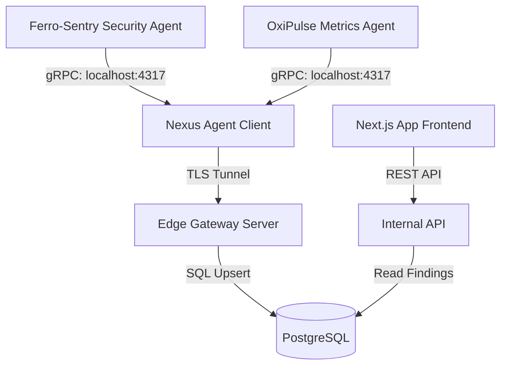

# Ferro-Sentry Project Context & Continuation Guide

This document acts as a handoff context guide to continue the development of **Ferro-Sentry** in a new chat. It summarizes the current state, technical implementation, and next steps for building the product web landing page and the unified installer script.

---

## 1. System Architecture

The agent ecosystem is unified under the local **Nexus Agent** using gRPC tunneling:

1. **`ferro-sentry`**: Local Rust agent. Performs periodic security audits (port scanning, SSH configurations, SUID binaries) and forwards findings via local gRPC to `127.0.0.1:4317`.
2. **`nexus-agent`**: The orchestrator. Hosts a local gRPC server multiplexing OxiPulse metrics and Ferro-Sentry security events. It packs security events into a `TunnelEnvelope_SecurityEventPayload` wrapper and pipes it through the outbound TLS tunnel connection to the cloud.
3. **`edge-gateway`**: Ingestion server (Go). Receives the stream envelope. It looks up the `ferrosentry` agent ID belonging to the server's `server_id` in the database, parses the JSON payload, and writes/upserts findings to `agent_security_findings`.
4. **`app`**: Frontend dashboard (Next.js). Queries the `/agents/{agent_id}/security-findings` API and renders the security posture panel with color-coded severity badges and remediation recommendations.

---

## 2. Technical Implementation Details

### Database Schema (`agent_security_findings` table)
- **Columns:** `id` (UUID), `agent_id` (UUID, FK to `agents`), `event_type` (String), `category` (String), `severity` (String), `module` (String), `rule_triggered` (String, nullable), `details` (JSONB), `resolved_at` (Timestamp, nullable), `created_at` (Timestamp), `updated_at` (Timestamp).
- **Constraints:** Uniquely handles active findings with a partial index:
  `CREATE UNIQUE INDEX uq_active_findings ON agent_security_findings(agent_id, module, rule_triggered) WHERE resolved_at IS NULL;`

### Code Locations & Changes

1. **`d:\ferro-sentry`**:
   - `src/output/sb_agent.rs` (`SbAgentOutput`): Implements `SecurityServiceClient` via `tonic` and forwards findings using local gRPC connection.
   - `build.rs` & `Cargo.toml`: Configured to compile `tunnel.proto` using `tonic-build`.
2. **`d:\nexus-agent`**:
   - `src/proxy/mod.rs`: Registers and runs `SecurityProxyService` multiplexed alongside metrics on `127.0.0.1:4317`.
   - `src/registry/mod.rs`: Process detection updated to search for `ferro-sentry` (with hyphen) to accurately report running status.
   - Configuration (`C:\ProgramData\SecuryBlack\agent.toml`): Includes `enabled_agents = ["oxipulse", "ferrosentry"]`.
3. **`d:\edge-gateway`**:
   - `internal/tunnel/server.go`: Receives the gRPC tunnel stream event. Queries for the `ferrosentry` type agent row under the incoming `server_id` to get its UUID, then upserts the finding to PostgreSQL under that ID.
4. **`d:\app`**:
   - `src/lib/services/agents.ts`: Added `SecurityFinding` interface and `getSecurityFindings(agentId)` API call wrapper.
   - `src/app/(app)/servers/[id]/page.tsx`: Embedded `AgentSecuritySection` component. Renders green posture status if no findings exist, or lists findings grouped by severity with tailored remediations if active.

---

## 3. Current Live Status

- Both **Nexus Agent** and **Ferro-Sentry** are configured and running successfully as Windows Services.
- `nexus-agent` correctly reports `ferrosentry` as `running` in the database.
- Database records have been migrated to the correct `ferrosentry` agent UUID.
- The local FastAPI backend (`api-internal`) is running on port `8000` under uvicorn.

---

## 4. Next Steps for the Next Chat

When opening the next chat, prioritize the following tasks:

### Task A: Web Landing Page Creation
- Design a high-impact, modern product landing page for Ferro-Sentry within the SecuryBlack ecosystem.
- Adhere strictly to rules in `d:\homepage\AGENTS.md` and style definitions in `DESIGN.md`.
- Clearly explain the active defense, continuous posture auditing, and unified agent telemetry capabilities.

### Task B: Unified Installation Script
- Build an installation script (typically PowerShell for Windows and Shell script for Linux) that:
  1. Installs the compiled agent binaries.
  2. Creates and registers the service (`FerroSentry` on Windows SCM).
  3. Detects if `nexus-agent` is present, updates its config `/agent.toml` `enabled_agents` array to include `"ferrosentry"`, and restarts the services.
  4. Correctly configures path escapes and token setups.
